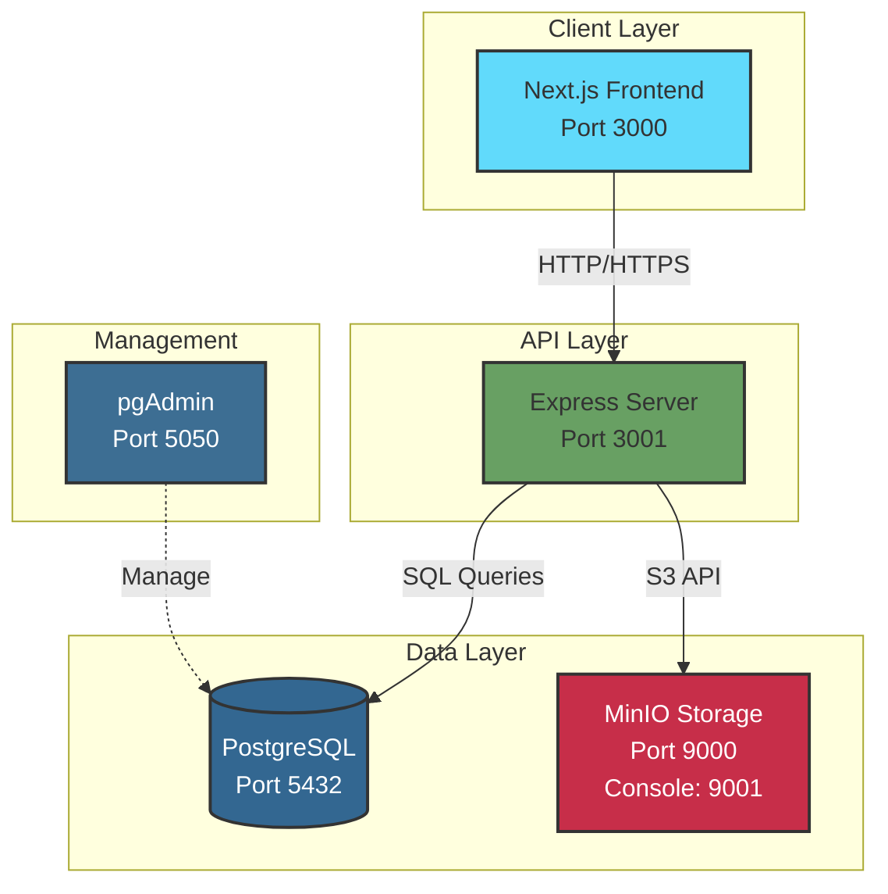

## Service URLs

- **Frontend:** http://localhost:3000
- **API:** http://localhost:3001
- **API Health:** http://localhost:3001/health
- **MinIO Console:** http://localhost:9001 (minioadmin/minioadmin123)
- **MinIO API:** http://localhost:9000
- **PostgreSQL:** localhost:5432 (rentalapp/changeme123)
- **pgAdmin:** http://localhost:5050 (admin@rentalapp.com/admin123)

## Data Flow

1. User accesses **Frontend** (Next.js)
2. Frontend calls **Backend API** (Express)
3. Backend queries **PostgreSQL** for data
4. Backend stores/retrieves images from **MinIO**
5. **pgAdmin** manages database (optional)

## Docker Volumes

- `postgres_data` - Database persistence
- `minio_data` - File storage persistence
- `pgadmin_data` - pgAdmin settings

## Networks

- `rentalapp-network` - Bridge network connecting all services
